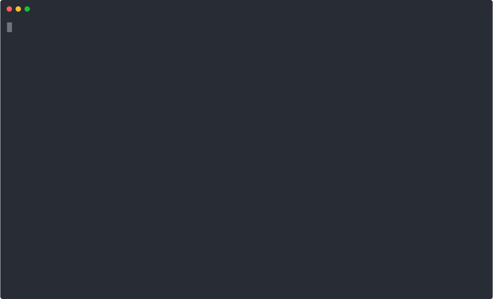

<div align="center">

# dcx

**DevContainer Extended - sandboxed development without the hassle**

[](https://github.com/kobus-v-schoor/dcx/actions/workflows/ci.yml)
[](https://github.com/kobus-v-schoor/dcx/releases)

[](https://asciinema.org/a/1118070)

</div>

---

> [!IMPORTANT]
> This project is still in alpha. Expect bugs and changes to the config structure as it matures.

Sandboxing your dev environment is a Good Idea™, but it's often too much of a
hassle to apply quickly and consistently. dcx solves this by wrapping and
integrating your most common development tools to give you a safe, comfortable
dev environment.

**Why sandbox your dev environment?** Supply-chain attacks are on the rise
([1](https://github.com/axios/axios/issues/10636),
[2](https://www.wiz.io/blog/trivy-compromised-teampcp-supply-chain-attack),
[3](https://docs.litellm.ai/blog/security-update-march-2026)). Every dependency
you install, every script you run, and every AI coding agent you trust has the
potential to compromise your machine. The safest approach is to **do all your
development inside a sandboxed container**. This means friction: lost configs,
missing credentials, and a dev environment that doesn't feel like home.

**dcx** wraps and integrates mature, and widely used tools, to give you a
sandboxing experience without the hassle.:

- 🐳 **Sandboxed dev container via Docker/Devcontainers** - your dev tools now
  only has access to your workspace directory
- 🔒 **Credential injection via transparent proxy** - your GitHub token (and
  other secrets) are injected at the network layer and **never exposed inside
  the container**. Tools like `git` and `gh` just work, without ever seeing the
  real token.
- 🤖 **Run coding agents safely** - give an AI agent full access to your
  codebase *inside* the sandbox. Even if the agent goes rogue, your host
  machine and credentials stay protected. YOLO mode no longer feels so scary.
- 🏠 **Your dev environment, everywhere** - SSH agent, git config, shell
  config, and custom mounts are automatically forwarded into every
  devcontainer.
- ⚡ **Zero-friction workflow** - `dcx up` starts your container, `dcx exec`
  drops you into a shell with all your tooling available and working. No manual
  setup required.

## How It Works

dcx uses the `devcontainer` CLI under-the-hood to do all the heavy lifting. Through
devcontainers it builds on top of a widely-used spec to give you reproducible, but
contained and extensible development environments, all inside containers.

Apart from providing user-level defaults for the `devcontainer` CLI, dcx also
integrates several common dev tools to make your container experience better:

- Automatic SSH agent forwarding
- Secret injection via a MITM proxy (this means your secrets, e.g. your
  Github token, is never available inside the container)
- Automatic git config integration
- Shell and other configs bind-mounted inside the container
- Env var injection

By building on top of the [devcontainer spec](https://github.com/devcontainers/spec),
dcx remains lightweight while providing a _lot_ of features.

## Why not just use devcontainers directly?

The `devcontainer` spec and CLI was built with reproducibility in mind - it
doesn't support user-level config (e.g. default features or bind-mounts) as
this would be fragile to support between teams. VSCode fixes this gap by
providing those features - but users who don't use VSCode doesn't have the same
luxury.

This is where dcx comes in - it wraps the `devcontainer` CLI to provide
features the official CLI probably shouldn't have. Think of `dcx` as a wrapper
to personalise `devcontainers` (with a bunch of other Quality-of-Life
improvements).

## Quick Start

### Install

```bash
# Via the install script
curl -fsSL https://raw.githubusercontent.com/kobus-v-schoor/dcx/main/install.sh | bash

# From source (requires Go 1.25+)
go install github.com/kobus-v-schoor/dcx/cmd/dcx@latest
```

> [!NOTE]
> Homebrew support will follow as soon as `dcx` meets the minimum project
> requirements

### Prerequisites

- [Docker](https://docs.docker.com/get-docker/) - running and accessible
- [devcontainer CLI](https://github.com/devcontainers/cli) - on your `PATH`
- Go 1.25+ - only needed when building from source

### Run

```bash
# Start your devcontainer
dcx up

# Open a shell inside it
dcx exec

# Stop or remove the container
dcx stop
dcx down
```

That's it. dcx reads your project's `.devcontainer/devcontainer.json` and
layers your user-level config on top - no changes to your project required.

## Documentation

Check out the [docs](docs) directory for more detailed info.
